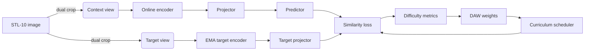

# easy2hard-jepa (DynaJEPA-STL10)

`easy2hard-jepa` implements a simplified Joint-Embedding Predictive Architecture (JEPA) with difficulty-aware weighting (DAW) and curriculum learning on the STL-10 dataset. All source code now lives at the repository root so you can clone the project and run the training scripts without diving into nested folders.

## Repository layout

```
.
├── configs/           # YAML configs for pretraining, DAW, and curriculum schedules
├── notebooks/         # Colab + local notebooks for experimentation
├── scripts/           # CLI entrypoints (pretrain, linear probe, visualizations, etc.)
├── src/dynajepa/      # Python package with models, training loop, DAW utilities
├── outputs/           # Created at runtime; holds checkpoints, logs, and figures
├── requirements.txt   # Minimal runtime dependencies
└── pyproject.toml     # Editable/installed package metadata
```

> **Tip:** install the package in editable mode with `pip install -e .` (or set `PYTHONPATH=src`) so that `python scripts/*.py` can import `dynajepa.*` modules without extra sys.path hacks.

## Method overview

- **Joint-Embedding Predictive Architecture (JEPA):** lightweight ResNet-18 encoder trained to predict a target representation produced by an EMA network.
- **Difficulty-Aware Weighting (DAW):** dynamically scores samples using their embedding distance statistics and reweights the loss with configurable softmax or power transforms.
- **Curriculum schedule:** linearly shifts the weight distribution from “easy” samples (low difficulty) to uniform and finally “hard” samples, encouraging stable early training and robust later learning.
- **Representation probes:** linear probe and k-NN evaluators quantify downstream performance, while t-SNE/UMAP provide qualitative feedback.

### Architecture sketch



The diagram highlights how DAW feedback loops into the loss to emphasize easy or hard samples depending on the current curriculum stage.

## Features

- Self-supervised JEPA pretraining with online and EMA target encoders
- Block-crop dual-view augmentation tailored for STL-10
- Difficulty-aware weighting with softmax or power weighting, clipping, and EMA smoothing
- Curriculum learning that transitions from easy to hard difficulty emphasis
- Mixed precision training with `torch.cuda.amp`
- Comprehensive logging via TensorBoard and text logs under `outputs/`
- Linear probe and k-NN evaluations on the STL-10 labeled split
- t-SNE and UMAP visualizations of learned embeddings
- Deterministic setup for reproducibility
- Lightweight ResNet-18 backbone for moderate compute requirements

## Using the `dynajepa` package

The source under `src/dynajepa/` is a standard Python package with the following key namespaces:

- `dynajepa.models`: encoder, projector, and predictor modules.
- `dynajepa.training`: training loop, checkpoints, logging, and curriculum scheduler implementations.
- `dynajepa.daw`: utilities for computing sample difficulty, smoothing, and weighting.
- `dynajepa.evals`: linear probe, k-NN, and visualization helpers.
- `dynajepa.utils`: configuration loading, seeding, distributed helpers.

After running `pip install -e .` you can script against these modules directly:

```python
from dynajepa.models.encoder import build_encoder
from dynajepa.daw.weighting import DifficultyWeighting

encoder = build_encoder(name="resnet18", projection_dim=256)
weighting = DifficultyWeighting(mode="softmax", tau=0.5)
```

This keeps imports predictable whether you run packaged scripts or integrate components into your own pipelines.

## Environment Setup

### Prerequisites

- Python 3.12 or newer
- At least one CUDA-capable GPU with 8 GB or more of memory (training also works on CPU, but will be slow)
- ~10 GB of free disk space for the STL-10 dataset, checkpoints, and exported features
- Git, pip, and a working C++ compiler toolchain (for packages such as `umap-learn`)

### Install PyTorch

Install PyTorch and TorchVision for your platform by following the [official instructions](https://pytorch.org/get-started/locally/). Choose the wheel that matches your CUDA toolkit (or CPU-only build) and make sure the versions satisfy `torch>=2.3` and `torchvision>=0.18`.

Example for CUDA 12.1:

```bash
pip install --upgrade "torch>=2.3" "torchvision>=0.18" --index-url https://download.pytorch.org/whl/cu121
```

Example for CPU-only environments:

```bash
pip install --upgrade "torch>=2.3" "torchvision>=0.18" --index-url https://download.pytorch.org/whl/cpu
```

### Clone the repository and install dependencies

```bash
git clone https://github.com/JinghongWu2003/easy2hard-jepa.git
cd easy2hard-jepa
pip install -r requirements.txt
```

The requirements file installs auxiliary packages such as NumPy, SciPy, scikit-learn, matplotlib, TensorBoard, tqdm, PyYAML, and UMAP.

### Optional: set up a virtual environment

Using `venv` or `conda` is recommended to isolate dependencies:

```bash
python -m venv .venv
source .venv/bin/activate  # Windows: .venv\Scripts\activate
pip install -r requirements.txt
```

Activate the environment each time you return to the project.

### Dataset download and storage

The training scripts automatically download the STL-10 dataset to `./data/` on first use. If you prefer to download manually (e.g., for offline clusters):

1. Download `stl10_binary.tar.gz` from the [STL-10 website](https://cs.stanford.edu/~acoates/stl10/).
2. Place the archive under `data/` (relative to the repo root) and extract it:

   ```bash
   mkdir -p data
   tar -xf stl10_binary.tar.gz -C data
   ```

3. The final layout should look like `data/stl10_binary/unlabeled_X.bin`, `data/stl10_binary/train_X.bin`, etc.

When running in cloud or cluster environments, make sure the `data/` directory resides on persistent storage so downloads are reused across jobs. Use the `data.dataset_root` config field to change the destination.

### Verify the installation

Run the included smoke test to confirm that the environment, dataset download, and logging directories are working:

```bash
python scripts/smoke_test.py --config configs/stl10_small_smoketest.yaml --run-name local_smoke
```

The script should finish within a few minutes, save a checkpoint to `outputs/local_smoke/checkpoints/`, and export features to `outputs/local_smoke/features/`.

## Quick Start

### Pretraining JEPA

Baseline JEPA without difficulty-aware weighting:

```bash
python scripts/pretrain.py --config configs/stl10_baseline.yaml
```

JEPA with difficulty-aware softmax weighting:

```bash
python scripts/pretrain.py --config configs/stl10_daw_softmax.yaml
```

JEPA with DAW and curriculum scheduling:

```bash
python scripts/pretrain.py --config configs/stl10_curriculum.yaml
```

All runs create directories under `outputs/<run_name>/` containing TensorBoard logs, text logs, checkpoints, and exported features.

#### Run customization

- **Change the run directory:** pass `--run-name my_experiment` to group outputs under `outputs/my_experiment/`.
- **Override configuration keys:** use `--override section.key=value` (e.g., `--override training.epochs=100`). Multiple overrides can be supplied.
- **Resume training:** specify `--resume path/to/checkpoint.pt` to continue from a saved state.
- **Device selection:** the config field `training.device` defaults to `cuda`. Set it to `cpu` if you do not have a GPU.

During training, monitor progress with TensorBoard:

```bash
tensorboard --logdir outputs/<run_name>/tensorboard
```

### Linear Probe

Train a frozen linear classifier on top of the pretrained encoder:

```bash
python scripts/linear_probe.py --checkpoint outputs/<run_name>/checkpoints/epoch_XXX.pt
```

### k-NN Evaluation

Perform a non-parametric k-NN classification on extracted features:

```bash
python scripts/knn_eval.py --checkpoint outputs/<run_name>/checkpoints/epoch_XXX.pt
```

### Visualizations

Generate t-SNE embeddings:

```bash
python scripts/visualize_tsne.py --checkpoint outputs/<run_name>/checkpoints/epoch_XXX.pt
```

Generate UMAP embeddings:

```bash
python scripts/visualize_umap.py --checkpoint outputs/<run_name>/checkpoints/epoch_XXX.pt
```

Figures are saved to `outputs/<run_name>/figs/`.

### Export raw features

To save normalized embeddings and labels to disk for downstream research, run:

```bash
python scripts/export_features.py --checkpoint outputs/<run_name>/checkpoints/epoch_XXX.pt --split test
```

Feature tensors are written to `outputs/<run_name>/features/<split>_features.pt` by default.

## Detailed Workflow

1. **(Optional) Smoke test** – ensures environment and dataset download work.
2. **Pretrain** – run one of the configs; training logs to `outputs/<run_name>/train.log` and TensorBoard.
3. **Inspect results** – view loss/weighting curves in TensorBoard, check exported features.
4. **Evaluate** – run linear probe and/or k-NN using the saved checkpoint.
5. **Visualize** – produce t-SNE/UMAP plots for qualitative analysis.
6. **Archive** – copy the `outputs/<run_name>/` directory or individual checkpoints for later use.

## Configuration Reference

| Section | Key | Description |
| --- | --- | --- |
| `data` | `dataset_root` | Directory where STL-10 is stored or downloaded. |
|  | `context_crop_ratio` / `target_crop_ratio` | Relative block sizes for context/target crops before resizing to 96×96. |
| `model` | `ema_momentum` | Momentum for the exponential moving average target encoder. |
| `loss` | `type` | `cosine` (default) or `l2`. |
| `training` | `base_lr`, `epochs`, `warmup_epochs`, `optimizer` | Core optimization hyperparameters. |
|  | `amp` | Enable or disable automatic mixed precision. |
|  | `save_interval` / `knn_interval` | Epoch cadence for checkpoints and embedding exports. |
| `daw` | `enabled`, `weighting`, `softmax_tau`, `clip_min`, `clip_max`, `ema_alpha` | Difficulty-aware weighting controls. |
| `curriculum` | `enabled`, `easy_epochs`, `uniform_epochs`, `hard_epochs` | Define curriculum stages for the weighting function. |

Refer to the YAML files in `configs/` for complete examples.

## Configuration

All YAML configs live in `configs/`. Use `--config` to select a base configuration and optionally override parameters via `--override key=value`. Key configuration options include:

- `data.batch_size`, `data.num_workers`, `data.context_crop_ratio`, `data.target_crop_ratio`
- `model.projector` and `model.predictor` hidden dimensions
- `training.epochs`, `training.base_lr`, `training.weight_decay`
- `loss.type` (`cosine` or `l2`)
- `daw` settings for difficulty computation, smoothing, weighting, and clipping
- `curriculum` schedule boundaries and modes

## Expected Performance

Pretraining for 200 epochs on a single GPU should reach STL-10 linear probe accuracy in the 70–75% range and k-NN accuracy around 60–65% on the test set. These numbers are indicative; actual results depend on compute budget, augmentations, and hyperparameters.

If performance is poor, verify that:

- The smoke test passes and checkpoints are saved
- TensorBoard logs show stable loss curves
- EMA momentum is not too high for short training runs
- DAW parameters do not collapse weights (check histogram summaries)
- Curriculum schedule boundaries align with total epochs

## Colab Usage

Open `notebooks/colab_stl10_dynajepa.ipynb` to run the project in Google Colab. The notebook checks environment versions, installs dependencies (skipping torch if already available), runs the smoke test, and provides example cells for pretraining and evaluation.

Tips for Colab:

- Select a GPU runtime via **Runtime → Change runtime type → GPU**.
- If the Colab environment already has a compatible PyTorch version, comment out the installation cell or pin to the matching CUDA build.
- Store checkpoints on Google Drive by mounting it (`from google.colab import drive; drive.mount('/content/drive')`) and setting `--run-name /content/drive/MyDrive/dynajepa_runs/<name>`.

## Makefile Shortcuts

- `make setup` – install Python dependencies
- `make pretrain CONFIG=configs/stl10_baseline.yaml`
- `make probe CHECKPOINT=path/to/ckpt.pt`
- `make knn CHECKPOINT=path/to/ckpt.pt`
- `make tsne CHECKPOINT=path/to/ckpt.pt`
- `make umap CHECKPOINT=path/to/ckpt.pt`
- `make smoke` – run the small smoke test configuration

## Troubleshooting

- **Out-of-memory errors:** reduce batch size, disable mixed precision, or switch to the small smoke configuration.
- **Slow downloads:** STL-10 is ~2.5 GB; ensure you have a stable connection or pre-download the dataset.
- **Determinism issues:** ensure you set `torch.backends.cudnn.deterministic = True` and `benchmark = False`, which are handled in `src/dynajepa/utils/seed.py`.
- **Permission errors on clusters:** set `data.dataset_root` and `outputs` to directories where you have write access.
- **Resume fails with missing tensors:** ensure the resume checkpoint matches the current model configuration and was saved after the first forward pass.

## License

This project is released under the MIT License. See [LICENSE](LICENSE) for details.
